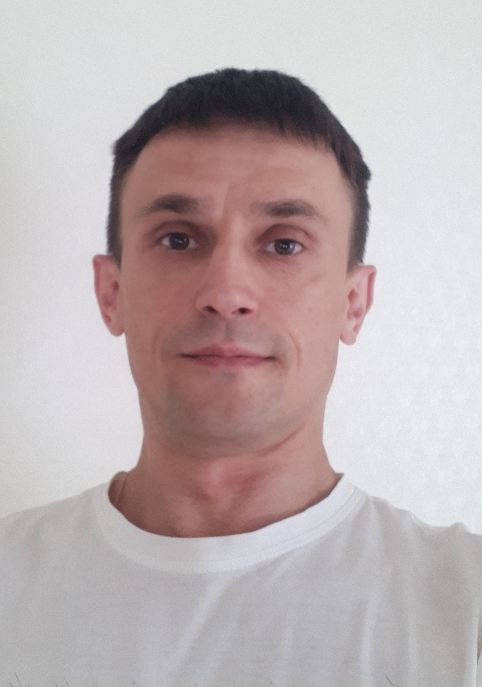

# [rsschool-cv](https://AndrewAndreev2019.github.io/rsschool-cv/)

---

## Andrew Andreev

---


---

### My Contacts

* __Location:__ Yaroslavl,Russia
* __Email:__  [aae1978](aae1978@gmail.com)
* __Github:__ [Andrew Andreev](https://github.com/AndrewAndreev2019)
* __Telegram:__ @wAvAvAw
* __Discord:__ andyarr(@AndrewAndreev2019)

---

### Skills

* HTML
  * DOM
* CSS
* JS (Basic)
* GIT
* Figma
* Word Press (Basic)

---

### Education

Modern Humanitarian Academy (Informatics and Computing Engineering)

---

### Code Example

``` 
function paperwork(n, m) {
  if(n<0)
   return 0;
 else if(m<0)
   return 0;
 else return n*m;
 };
```

---

### About me

I'm 44 years old self-study man. At start, WEB-development was only a hobby, but later i'm decided to try this RSSchool courses. I hope, i'm get new useful skills and improve my knowledge of JS.

---

### Languages

* __English__ - B1.
* __Russian__ - Native.

---
